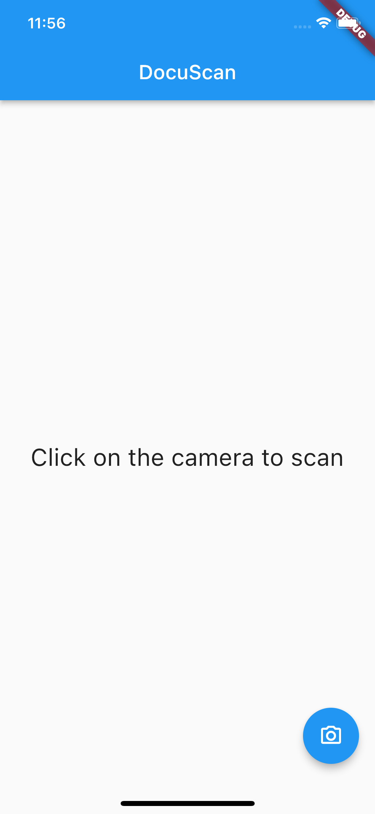
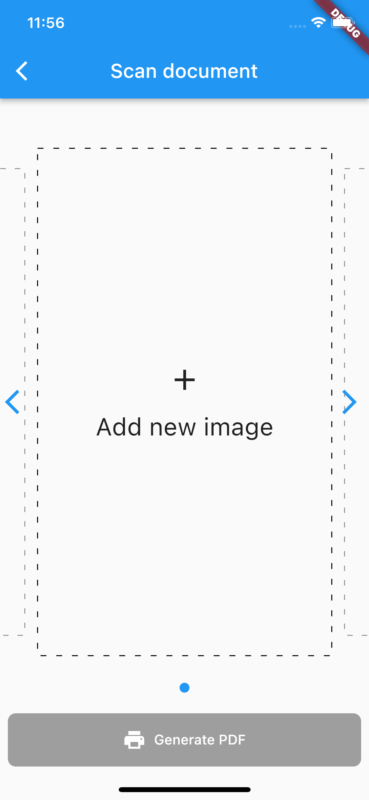

# 🔥🔥 DocuScan

 

Pdf scanner built with flutter.

Star⭐ the repo if you like what you see😉.

<!-- <a href="ss/app.apk"></img></a> -->

[Link to Mockup](https://www.ls.graphics/free/simple-iphone-x-mockups)

Pdf scanner built with flutter.

## Quick Start 🚀

## Feature Set ✨

* [x] Free & Open Source
* [x] Cross Platform App (Android - IOS)
* [x] Usable and user-friendly interface
* [x] Proper architecture for the code (We tried)
* [x] Scan documents
* [x] Detect edges
* [x] Convert scans to pdf
## RoadMap ✨
* [ ] PDF Tools
* [ ] CI/CD for reviewing the pull requests
* [ ] Publish the app to Google Play Store
* [ ] Multi themes, supports the light and dark theme

### PDF TOOLS
* [ ] Build a good UI
* [ ] PDF to Word
* [ ] PDF to Excel
* [ ] PDF to PPT
* [ ] PDF to Images
* [ ] PDF to Long Image
* [ ] PDF Page Reorder
* [ ] PDF Password
* [ ] PDF Watermark
* [ ] PDF Extract
* [ ] PDF Signature
* [ ] PDF Compress
* [ ] PDF Merge

## 📸 ScreenShots

| Image| Image|
|------|-------|
|||

## 🤓 Author(s)
**Samuel Abada** 